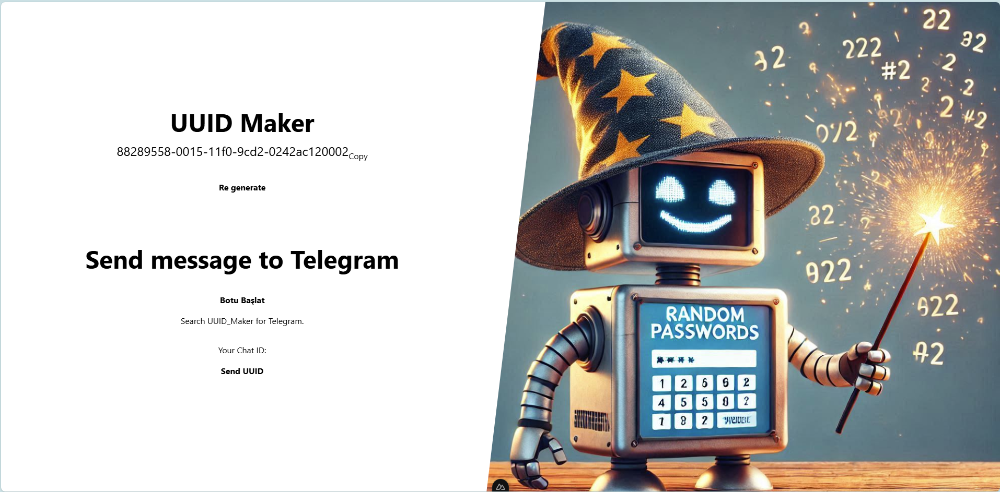

# Send uuid message telegram bot

Bu proje, [Telegram BotFather] için geliştirilmiş bir Nuxt.js uygulamasıdır.



## Başlarken

Bu talimatlar, projenin yerel makinenizde nasıl çalıştırılacağını açıklamaktadır.

- Bilgisayara Node.js kurulumu yapın.
- Projeyi klonlayın. Ve npm kurulumu yapın.

```bash
# npm setup
npm install
```

- Telegram uygulamasından BotFather kullanarak bir tane bot oluşturun.

Telegram'da BotFather kullanarak bir bot oluşturmak için aşağıdaki adımları izleyin:

1. **BotFather ile İletişime Geçin:**
   - Telegram uygulamasını açın ve arama çubuğuna `BotFather` yazın.
   - BotFather'ı seçin ve sohbet penceresini açın.

2. **Yeni Bot Oluşturma:**
   - BotFather sohbet penceresinde `/newbot` komutunu yazın ve gönderin.
   - BotFather sizden botunuz için bir isim isteyecektir. Örneğin, `UUID_Maker` yazabilirsiniz.
   - Ardından, botunuz için bir kullanıcı adı (username) isteyecektir. Bu kullanıcı adı benzersiz olmalı ve "_bot" ile bitmelidir. Örneğin, `uuid_maker_bot` yazabilirsiniz.

3. **Bot Token'ını Alın:**
   - BotFather, botunuzun oluşturulduğunu onaylayacak ve size bir API token verecektir. Bu token, botunuzu programlamak ve yönetmek için kullanılır. Bu bilgiyi güvenli bir yerde saklayın.


- Oluşturduğunuz botun TOKEN için .env dosyasına yazın. Örneğin

```bash
BOT_TOKEN = "7733******:AAHRc6*********************"
```
- Sonra projeyi çalıştırın.

```bash
# npm development server
npm run dev

#Start the development server on `http://localhost:3000`
```

Look at the [Nuxt documentation](https://nuxt.com/docs/getting-started/introduction) to learn more.
